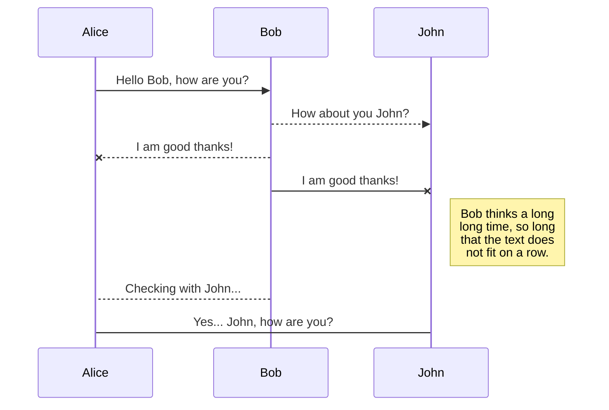

This section provides examples of all style elements available to documentation authors and the guidelines on using them.


## Code Blocks

Input:

<pre>
```js
const client = OdfClient::new("odf+https://localhost:8080");
```
</pre>

Result:

```js
const client = OdfClient::new("odf+https://localhost:8080");
```


## Text Blocks

Input:

```markdown

Tip block



Note block



Info block



Warning block



Danger block

```

Result:


Tip block



Note block



Info block



Warning block



Danger block



## Tables

Input:

```markdown
| Name | Description |
| ---- | :---------: |
| Foo  |    Test     |
| Bar  |    Test     |
```

Result:

| Name | Description |
| ---- | :---------: |
| Foo  |    Test     |
| Bar  |    Test     |


## Tabs

Input:

```markdown
 


Tab 1 content as text



Tab 2 content
- as
- list




Tab 3 content as rich elements




```

Result:




Tab 1 content as text



Tab 2 content
- as
- list




Tab 3 content as rich elements






## Static Image

Input:

```markdown

```

Result:




## YouTube Video

Input:

```markdown

```

Result:




## YouTube Playlist

Input:

```markdown

```

Result:



## GOAT Diagrams

Input:

<pre>
```goat
      .               .                .               .--- 1          .-- 1     / 1
     / \              |                |           .---+            .-+         +
    /   \         .---+---.         .--+--.        |   '--- 2      |   '-- 2   / \ 2
   +     +        |       |        |       |    ---+            ---+          +
  / \   / \     .-+-.   .-+-.     .+.     .+.      |   .--- 3      |   .-- 3   \ / 3
 /   \ /   \    |   |   |   |    |   |   |   |     '---+            '-+         +
 1   2 3   4    1   2   3   4    1   2   3   4         '--- 4          '-- 4     \ 4
```
</pre>

Result:

```goat
      .               .                .               .--- 1          .-- 1     / 1
     / \              |                |           .---+            .-+         +
    /   \         .---+---.         .--+--.        |   '--- 2      |   '-- 2   / \ 2
   +     +        |       |        |       |    ---+            ---+          +
  / \   / \     .-+-.   .-+-.     .+.     .+.      |   .--- 3      |   .-- 3   \ / 3
 /   \ /   \    |   |   |   |    |   |   |   |     '---+            '-+         +
 1   2 3   4    1   2   3   4    1   2   3   4         '--- 4          '-- 4     \ 4
```

See more examples [here](https://gohugo.io/content-management/diagrams/).

## Mermaid Diagrams

Input:

<pre>

</pre>

Result:


See more examples [here](https://mermaid.js.org/syntax/examples.html).
