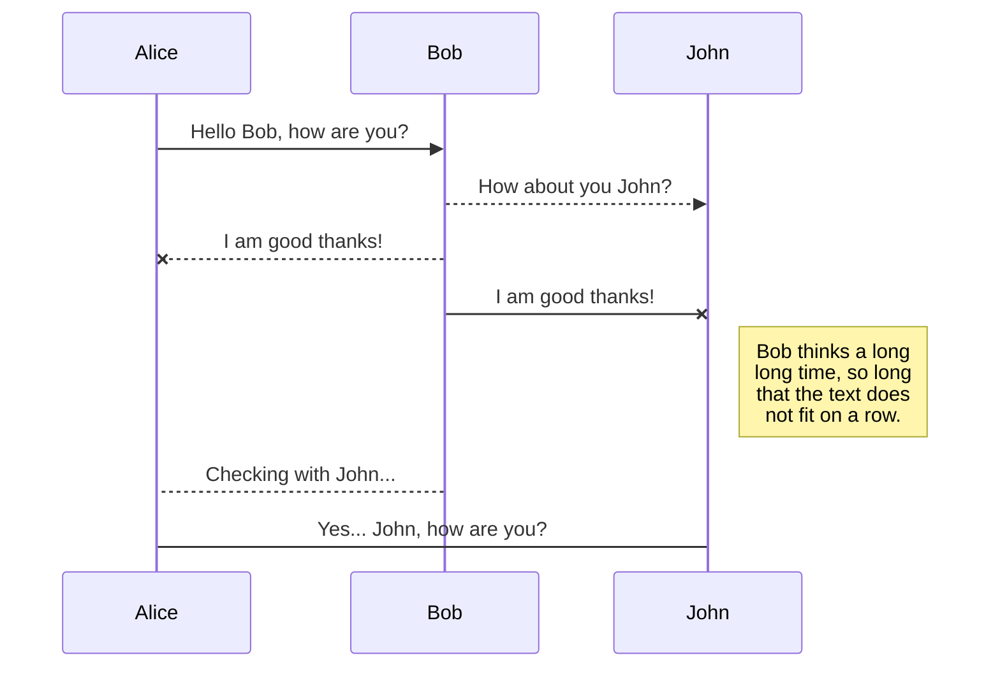

import {Term, Schema, YouTube, YouTubeList, Diagram} from '/components/common.jsx'

This section provides examples of all style elements available to documentation authors and the guidelines on using them.


## Links

We have special types of links to refer readers to:
- definitions of terms in the [Glossary](/glossary)
- schemas in the [Reference](/reference)

**Input:**

```
import {Term, Schema} from '/components/common.jsx'

Raw data is stored in <Term t="slices" id="data-slice"/> that
are linked from <Schema t="MetadataBlock"/>s.
```

**Result:**

Raw data is stored in <Term t="slices" id="data-slice"/> that are linked from <Schema t="MetadataBlock"/>s.


## Code Blocks

**Input:**

````mdx theme={null}
```js
const client = OdfClient::new("odf+https://localhost:8080");
```
````

**Result:**

```js
const client = OdfClient::new("odf+https://localhost:8080");
```


## Text Blocks

**Input:**

```markdown
<Tip>
Tip block
</Tip>

<Note>
Note block
</Note>

<Info>
Info block
</Info>

<Warning>
Warning block
</Warning>

<Danger>
Danger block
</Danger>
```

**Result:**

<Tip>
Tip block
</Tip>

<Note>
Note block
</Note>

<Info>
Info block
</Info>

<Warning>
Warning block
</Warning>

<Danger>
Danger block
</Danger>


## Tables

Input:

```markdown
| Name | Description |
| ---- | :---------: |
| Foo  |    Test     |
| Bar  |    Test     |
```

Result:

| Name | Description |
| ---- | :---------: |
| Foo  |    Test     |
| Bar  |    Test     |


## Tabs

**Input:**

```markdown
<Tabs>
  <Tab title="First tab">
    Tab 1 content with plain text
  </Tab>

  <Tab title="Second tab">
    Tab 2 with markdown
    - as
    - list
  </Tab>

  <Tab title="Third tab">
    <Info>Tab 3 content with rich elements</Info>
  </Tab>
</Tabs>
```

**Result:**

<Tabs>
  <Tab title="First tab">
    Tab 1 content with plain text
  </Tab>

  <Tab title="Second tab">
    Tab 2 with markdown
    - as
    - list
  </Tab>

  <Tab title="Third tab">
    <Info>Tab 3 content with rich elements</Info>
  </Tab>
</Tabs>


## Static Image

**Input:**

```markdown

```

Result:


## YouTube Video

**Input:**

```markdown
import {YouTube} from '/components/common.jsx'

<YouTube id="hN_vpHYmwi0"/>
```

**Result:**

<YouTube id="hN_vpHYmwi0"/>


## YouTube Playlist

**Input:**

```markdown
import {YouTubeList} from '/components/common.jsx'

<YouTubeList id="PLV91cS45lwVG20Hicztbv7hsjN6x69MJk"/>
```

**Result:**

<YouTubeList id="PLV91cS45lwVG20Hicztbv7hsjN6x69MJk"/>


## Mermaid Diagrams

**Input:**

````mdx theme={null}

````

**Result:**


See more examples [here](https://mermaid.js.org/syntax/examples.html).
