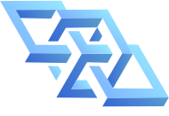
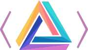

<Card
  title="First time here?"
  icon="rocket"
  href="/cli/get-started"
  horizontal
>
  Start with this Kamu CLI tutorial to learn the basics in the comfort of your laptop.
</Card>

## Projects
Our documentation is organized around 4 closely related projects:

<Columns cols={2}>
  <Card href="/odf">
    <h4 class="project-title">Open Data Fabric</h4>
    
    ODF is an open protocol spec for exchange and verifiable multi-party processing of data. It's an independent open-source project. It is included on this website for convenience of cross-referencing with the rest of documentation.

    <Columns cols={2}>
      
<a href="/x" class="project-quicklink">&gt; Introduction</a>

      
<a href="/x" class="project-quicklink">&gt; Specification</a>

      
<a href="/x" class="project-quicklink">&gt; Reference</a>

      
<a href="/x" class="project-quicklink">&gt; RFCs</a>

    </Columns>
  </Card>

  <Card href="/cli">
    <h4 class="project-title">Kamu CLI</h4>
    
    A powerful command line tool that implements ODF protocol. You can run it on any device to build data pipelines, ingest and explore data, and interact with other nodes on ODF network.

    <Columns cols={2}>
      
<a href="/x" class="project-quicklink">&gt; Overview</a>

      
<a href="/x" class="project-quicklink">&gt; Demo</a>

      
<a href="/x" class="project-quicklink">&gt; Install</a>

      
<a href="/x" class="project-quicklink">&gt; First steps</a>

    </Columns>
  </Card>

  <Card href="/node">
    <h4 class="project-title">Kamu Node</h4>
    
    A scalable server implementation of ODF. It's a set of Kubernetes applications that can be installed in a distributed environment to:
    - Operate data pipelines
    - Verify computations done by other parties
    - Execute queries on co-located data
    - Provide data via rich set of APIs to applications and smart contracts.
  
    <Columns cols={2}>
      
<a href="/x" class="project-quicklink">&gt; Quick Start</a>

      
<a href="/x" class="project-quicklink">&gt; Protocols</a>

      
<a href="/x" class="project-quicklink">&gt; Deploying</a>

      
<a href="/x" class="project-quicklink">&gt; Operating</a>

    </Columns>
  </Card>

  <Card href="/platform">
    <h4 class="project-title">Kamu Web Platform</h4>
    
    A front-end application that acts as a window into the ODF network. Think of it as GitHub for data pipelines or Etherscan of ODF. It can be used in multiple setups: from exploring your local Kamu CLI workspace, to managing your distributed Kamu Node deployment, and to interacting with remote nodes in the global ODF network.

    <Columns cols={2}>
      
<a href="/x" class="project-quicklink">&gt; Overview</a>

      
<a href="/x" class="project-quicklink">&gt; Get Started</a>

      
<a href="/x" class="project-quicklink">&gt; Administration</a>

    </Columns>
  </Card>
</Columns>
